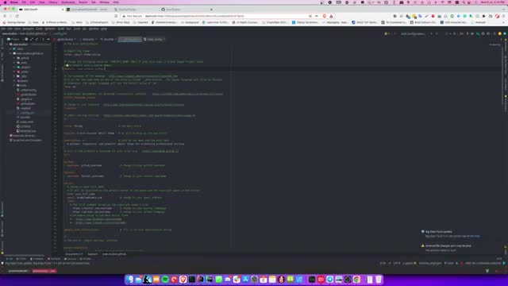

# IntelliJ Ultimate
Docker image for my favorite code editor: intellij Ultimate.

### Base Image

- [Alpine:Edge](https://hub.docker.com/_/alpine)
- [influx6:novnc](https://hub.docker.com/r/influx6/novnc)

## Docker

- [IntelliJ Ultimate](https://hub.docker.com/r/influx6/intellij-u)
- [IntelliJ Community](https://hub.docker.com/r/influx6/intellij-c)

**Example**
```
docker run -d \
    -p 5900:5900 \
    -p 6080:6080 \
    -p 7080:7080 \
    --name=novnc \
    -e DISPLAY_WIDTH=<> \
    -e DISPLAY_HEIGHT=<> \
    -e DISPLAY_DEPTH=<> \
    -e VNC_SERVER=<x11 or tigervnc> (default: tigervnc) \
    -e VNC_PASSWORD=mypassword \
    -e GUACA_PASSWORD=mypassword \
    influx6/intellj-u:latest
```

## Docker Compose

File:  docker-compose.yml

```yaml
version: "3.5"

networks:
  default:
    external:
      name: app-networks

volumes:
  intelliju-volume-data:

services:
  code-server-intellij:
    image: "influx6/intellij-u:0.0.4"
    restart: unless-stopped
    container_name: code-server-intellij
    security_opt:
      - apparmor=unconfined
      - seccomp=unconfined
    environment:
      - PUID=1000
      - PGID=1000
      - "APP=INTELLIJ_UL"
      - "VNC_PASSWORD=$VNC_PASSWORD"
      - "GUACA_PASSWORD=$GUACA_PASSWORD"
      - "SECURITY_TYPE=$SECURITY_TYPE"
      - "GUACA_SSL=$GUACA_SSL"
    volumes:
      - intelliju-volume-data:/home/novnc/.idea
      - "$SERVER_HOME/Lab:/home/novnc/Lab:rw"
      - "$HOST_FILE:/etc/hosts:rw"
      - "$TERMINAL_FILE:/etc/.terminal:ro"
      - "$SSH_FILE:/etc/ssh/id_rsa:ro"
      - "$SSH_PUB_FILE:/etc/ssh/id_rsa.pub:ro"
      - "$SSH_FILE:/home/novnc/.ssh/id_rsa:ro"
      - "$SSH_PUB_FILE:/home/novnc/.ssh/id_rsa.pub:ro"
    ports:
      - "6080:6080"
      - "7080:8080"
      - "5900:5900"

```

Be aware as exactly as above, feel free to customize.

Which can be executed as:

```bash
docker-compose --env-file .env -f docker-compose.yml
```

Important points:

```yaml
security_opt:
  - apparmor=unconfined
  - seccomp=unconfined
```

These security grants are required as there are errors with the container running file system related operations, so be it via docker-compose or plain docker run commands ensure to include them.

```bash
docker run --security-opt apparmor=unconfined --security-opt seccomp=unconfined ...
```

## Guacamole Client

Installed with the VNC client is a guacamole client and server which can act as a better alternative to raw NoVNC web app for
accessing your service.

Simply navigate to: http://localhost:7080/guacamole

Default username and password are: novnc (password can be customized via environment variables `GUACA_PASSWORD`)

Guacamole Login


IntelliJ via Guacamole




[](https://youtu.be/zIjhRxnz51w)


## NoVNC Web App


**Access via web interface (noVNC)**

`https://<host ip>:<host port>/vnc.html?resize=remote&host=<host ip>&port=<host port>&&autoconnect=1`

e.g.:-

`https://192.168.1.10:6080/vnc.html?resize=remote&host=192.168.1.10&port=6080&&autoconnect=1`

Project comes with a self-signed certificate, so you will have to tell your browser to load page regardless of warning. 

**Access via VNC client**

`<host ip>::<host port>`

e.g.:-

`192.168.1.10::5900`

**Usage**
```
docker run -d \
    -p 5900:5900 \
    -p 6080:6080 \
    --name=<container name> \
    influx6/intellij-u:latest
```

To run with another application, write your own docker file:

```docker-file
FROM influx6/intellij-u:latest
RUN \
    # Install xterm
    apk add xterm && \
    # Append xterm entry to supervisord.conf
    cd /etc/supervisord/ && \
    echo '[program:xterm]' > 03-myapp.conf && \
    echo 'command=xterm' >> 03-myapp.conf && \
    echo 'autorestart=true' >> 03-myapp.conf
```


**Notes**

User ID (PUID) and Group ID (PGID) can be found by issuing the following command for the user you want to run the container as:-

```
id <username>
```

### Gotcha

I noticed at times even when directly using Guacamole or other VNC client that the size of the display is usually small,
I have yet to find a way to fix this, but the NoVNC client seems to have some underline logic that will force a resize of
giving display, so if you see your desktop VNC client or Guacamole displaying a smaller size than your available desktop space, do the following:

1. Navigate to the NoVNC web login portal (see [NoVNC Web App](#novnc-web-app) section)
2. Login with your login credentials
3. NoVNC will show your desktop
4. Ensure resize=remote is enabled in settings
5. Apply settings if not.

You can also paste the following url with the correct options

`https://[ip]:6080/vnc.html?resize=remote&host=192.168.1.10&port=6080&&autoconnect=1`

These will correct the display size and will reflect on other VNC client you are using.
